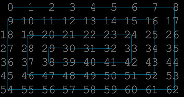

# helix-array


Output an array in helix order.




# usage

```js
var helixArray = require('helix-array').helixArray;

const arr = [0, 1, 2, 3, 4, 5];

helixArray(arr, 2, 3)// [0, 1, 3, 5, 4, 2]
helixArray(arr, 3, 2)// [0, 1, 2, 5, 4, 3]

```